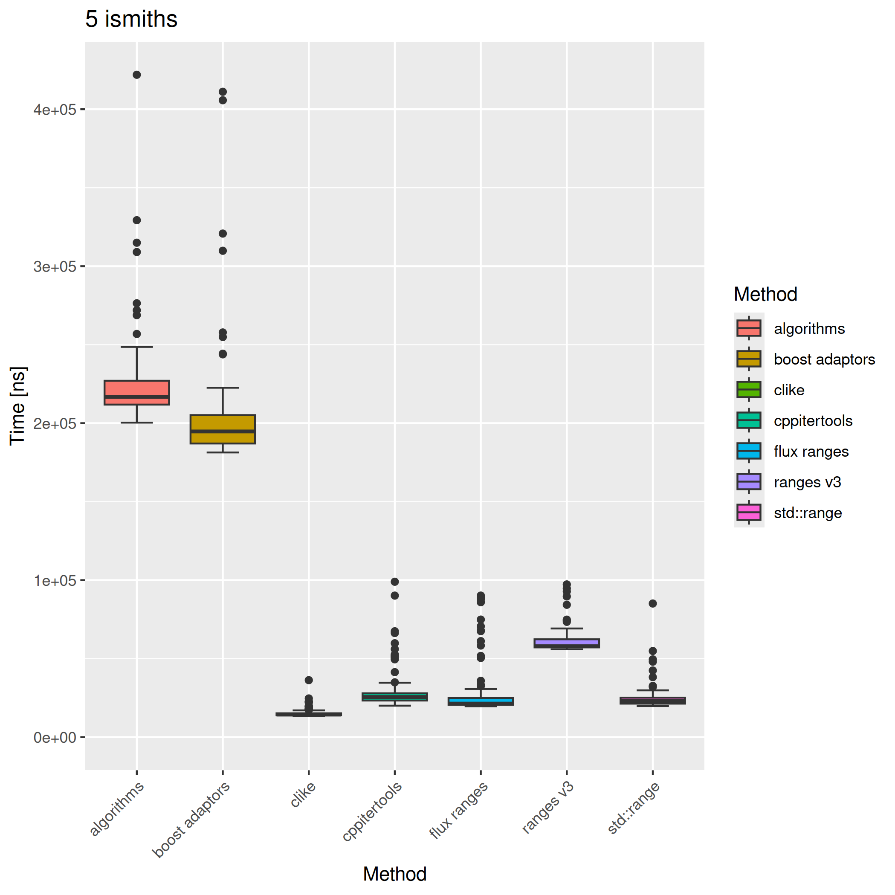
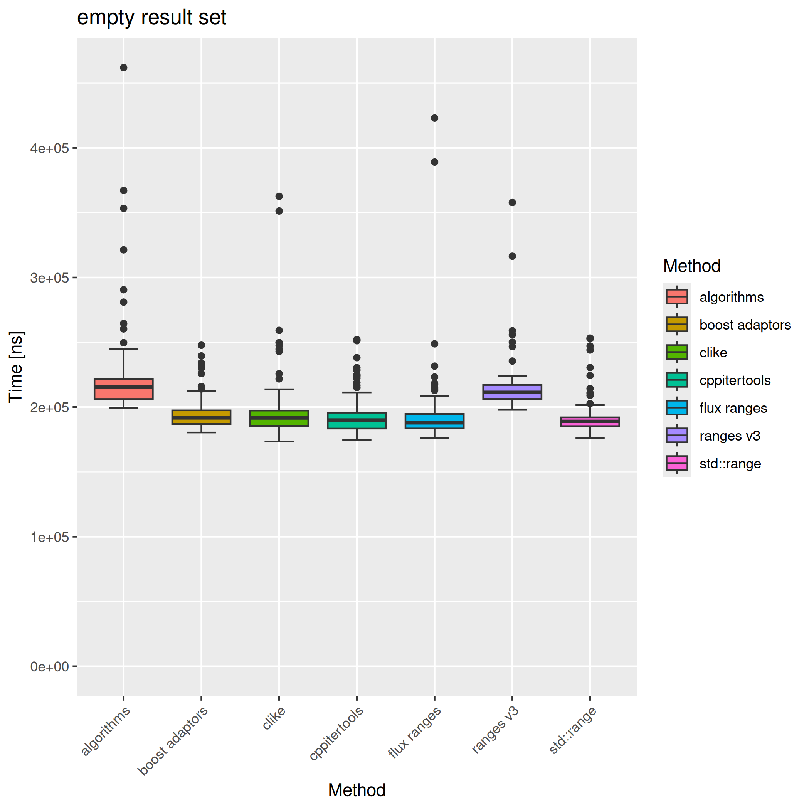
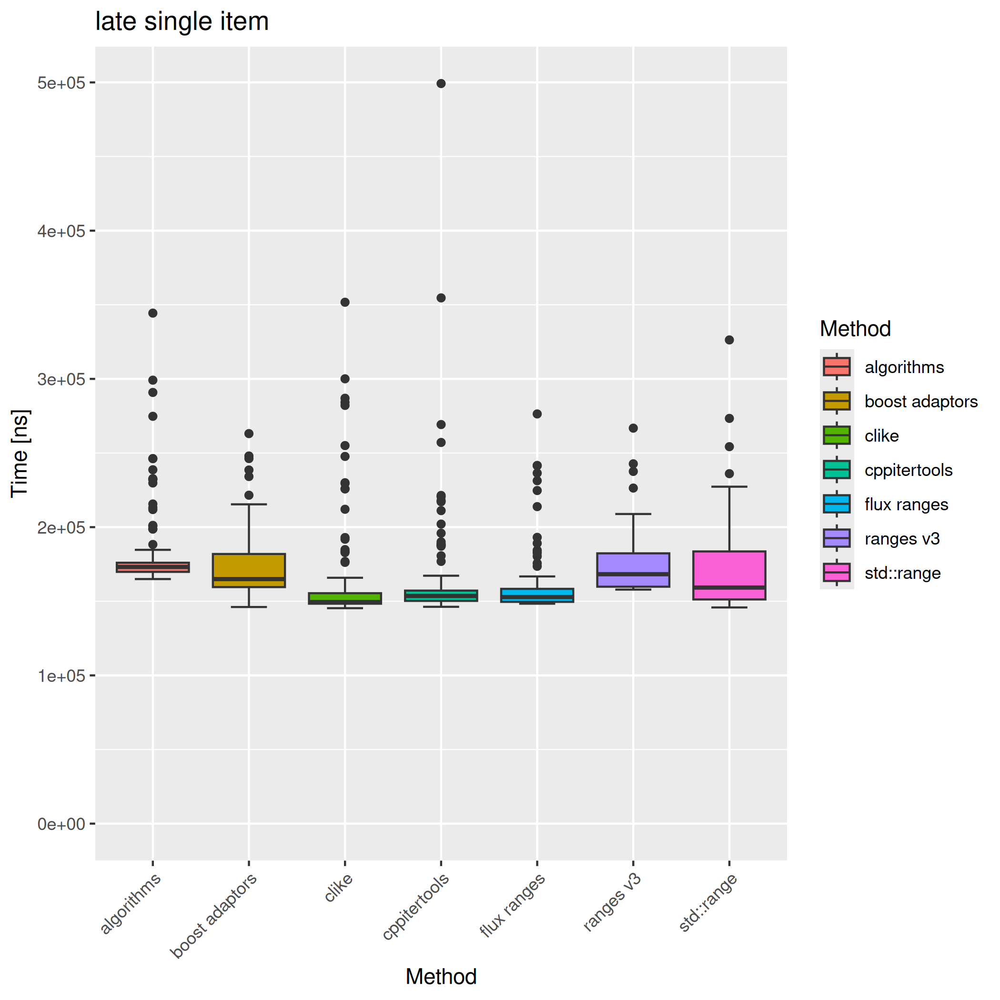
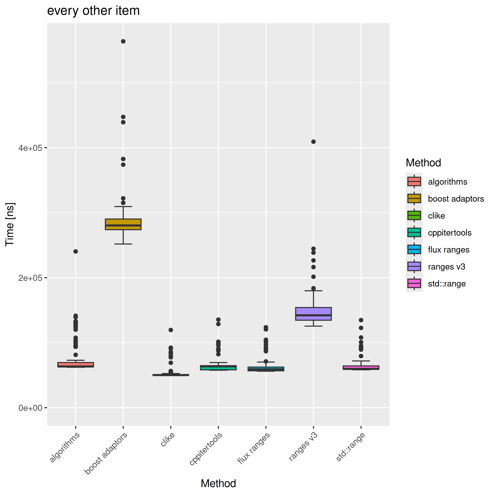

# C++ ranges benchmark

A C++ range libraries benchmark described in [the blog post](https://dev.to/serpent7776/comparing-c-range-libraries-for-filterreverse-case-with-non-trivial-lambda-4lj7)

## Results

